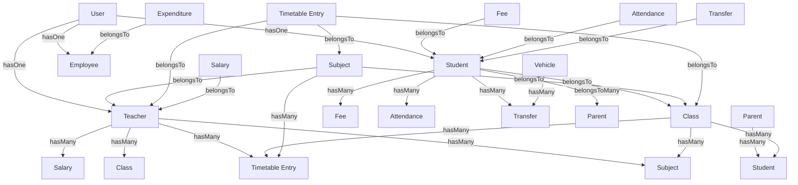

# School Management System - Database Design

## Entity Relationship Diagram

## Database Tables Structure

### 1. users
- id (bigIncrements)
- name (string)
- email (string, unique)
- password (string)
- role (string) - admin, teacher, student, parent, employee
- email_verified_at (timestamp, nullable)
- remember_token (string, nullable)
- created_at (timestamp)
- updated_at (timestamp)

### 2. teachers
- id (bigIncrements)
- user_id (foreignId to users.id)
- name (string)
- email (string, unique)
- phone (string)
- address (text)
- qualification (string)
- experience (integer)
- joining_date (date)
- created_at (timestamp)
- updated_at (timestamp)

### 3. students
- id (bigIncrements)
- user_id (foreignId to users.id)
- class_id (foreignId to classes.id)
- name (string)
- email (string, unique)
- phone (string)
- address (text)
- date_of_birth (date)
- admission_date (date)
- gender (string)
- blood_group (string)
- created_at (timestamp)
- updated_at (timestamp)

### 4. employees
- id (bigIncrements)
- user_id (foreignId to users.id)
- name (string)
- email (string, unique)
- phone (string)
- address (text)
- position (string)
- department (string)
- salary (decimal)
- joining_date (date)
- created_at (timestamp)
- updated_at (timestamp)

### 5. parents
- id (bigIncrements)
- user_id (foreignId to users.id)
- name (string)
- email (string, unique)
- phone (string)
- address (text)
- occupation (string)
- created_at (timestamp)
- updated_at (timestamp)

### 6. student_parent (pivot table)
- student_id (foreignId to students.id)
- parent_id (foreignId to parents.id)

### 7. classes
- id (bigIncrements)
- name (string)
- teacher_id (foreignId to teachers.id, nullable)
- academic_year (string)
- capacity (integer)
- created_at (timestamp)
- updated_at (timestamp)

### 8. subjects
- id (bigIncrements)
- name (string)
- class_id (foreignId to classes.id)
- teacher_id (foreignId to teachers.id, nullable)
- code (string)
- description (text)
- created_at (timestamp)
- updated_at (timestamp)

### 9. timetable_entries
- id (bigIncrements)
- class_id (foreignId to classes.id)
- subject_id (foreignId to subjects.id)
- teacher_id (foreignId to teachers.id)
- day_of_week (string)
- start_time (time)
- end_time (time)
- room (string)
- created_at (timestamp)
- updated_at (timestamp)

### 10. fees
- id (bigIncrements)
- student_id (foreignId to students.id)
- amount (decimal)
- due_date (date)
- paid (boolean, default false)
- paid_date (date, nullable)
- description (text)
- created_at (timestamp)
- updated_at (timestamp)

### 11. salaries
- id (bigIncrements)
- teacher_id (foreignId to teachers.id)
- amount (decimal)
- payment_date (date)
- month (string)
- year (string)
- status (string)
- created_at (timestamp)
- updated_at (timestamp)

### 12. attendances
- id (bigIncrements)
- student_id (foreignId to students.id)
- date (date)
- status (string) - present, absent, late, holiday
- remarks (text)
- created_at (timestamp)
- updated_at (timestamp)

### 13. transfers
- id (bigIncrements)
- student_id (foreignId to students.id)
- vehicle_id (foreignId to vehicles.id, nullable)
- transfer_date (date)
- type (string) - pickup, dropoff
- status (string)
- created_at (timestamp)
- updated_at (timestamp)

### 14. vehicles
- id (bigIncrements)
- name (string)
- registration_number (string)
- driver_name (string)
- driver_phone (string)
- capacity (integer)
- created_at (timestamp)
- updated_at (timestamp)

### 15. expenditures
- id (bigIncrements)
- employee_id (foreignId to employees.id, nullable)
- amount (decimal)
- description (text)
- date (date)
- category (string)
- created_at (timestamp)
- updated_at (timestamp)